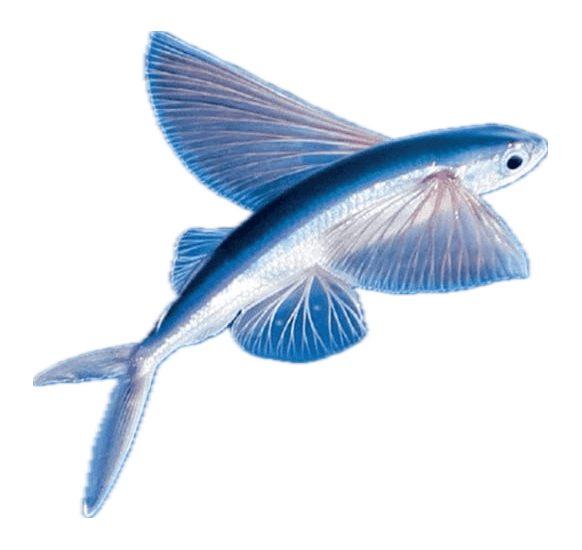
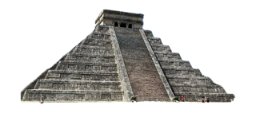
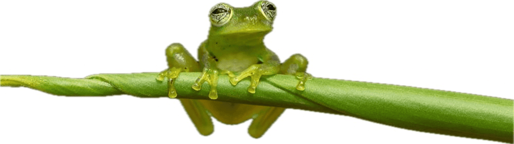
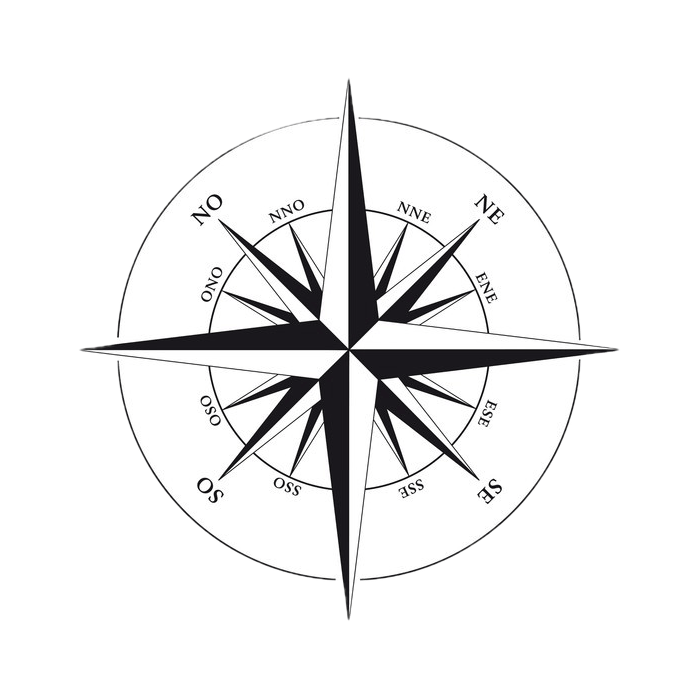

<!-- Import packages CSS -->
<link
  rel="stylesheet"
  href="https://unpkg.com/leaflet@1.9.4/dist/leaflet.css"
/>
<link href="https://fonts.googleapis.com/icon?family=Material+Icons" rel="stylesheet">
<link href="https://fonts.googleapis.com/css2?family=Permanent+Marker&display=swap" rel="stylesheet">
<link href="https://fonts.googleapis.com/css2?family=Life+Savers:wght@400;700;800&display=swap" rel="stylesheet">

<!-- Import local CSS -->
<link rel="stylesheet" href="assets/css/style.css">
<link rel="stylesheet" href="assets/css/main.css">
<link rel="stylesheet" href="assets/css/poi.css">

<!-- Import packages JS -->

<!-- Import local JS -->

<!-- Code -->

<link rel="icon" type="image/png" href="{{ '/favicon.png' | relative_url }}">

<header class="main-header">

        <h1 class="hover-title">
            ROROAD
            &nbsp;
            TRIP
        </h1>
        
        
        
        
        
        
    

</header>

    
💻 Ce site est optimisé pour un usage sur ordinateur.

    <button onclick="this.parentElement.style.display='none'">Continuer quand même</button>

<a href="https://forms.gle/EgaQ7tgcw7v7PLp9A" target="_blank" class="bug-report-button">
    <svg xmlns="http://www.w3.org/2000/svg" height="24" viewBox="0 -960 960 960" width="24" fill="currentColor"><path d="M480-80q-106 0-186-68.5T197-322l-77 77-57-56 87-87q-13-26-21.5-54.5T120-423h-80v-80h80q0-25 5-51.5t16-52.5l-95-94 57-57 101 101q41-55 101-89t128-40v-95h80v95q68 6 128 40t101 89l101-101 57 57-95 94q11 26 16 52.5t5 51.5h80v80h-80q0 28-8.5 56.5T836-332l87 87-57 56-77-77q-17 104-97 172.5T480-80Zm0-120q75 0 127.5-52.5T660-380v-100H300v100q0 75 52.5 127.5T480-200Zm-100-260h200v-120q0-42-29-71t-71-29q-42 0-71 29t-29 71v120Z"/></svg>
</a>

<footer class="main-footer">
    
&copy; 2026 Yann Rodriguez. All rights reserved.

</footer>