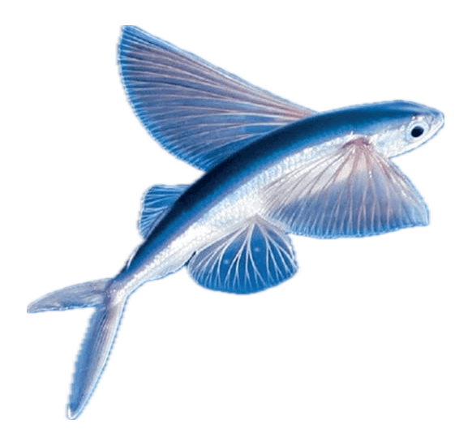
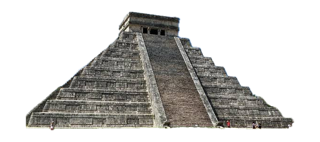
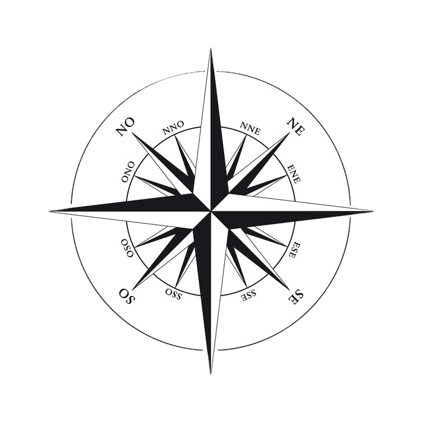
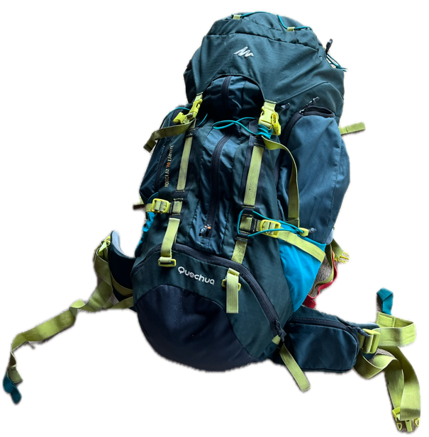

<!-- Import packages CSS -->
<link rel="stylesheet" href="https://cdnjs.cloudflare.com/ajax/libs/normalize/8.0.1/normalize.min.css">
<link
  rel="stylesheet"
  href="https://unpkg.com/leaflet@1.9.4/dist/leaflet.css"
/>
<link href="https://fonts.googleapis.com/icon?family=Material+Icons" rel="stylesheet">
<link href="https://fonts.googleapis.com/css2?family=Permanent+Marker&display=swap" rel="stylesheet">
<link href="https://fonts.googleapis.com/css2?family=Life+Savers:wght@400;700;800&display=swap" rel="stylesheet">

<!-- Import local CSS -->
<link rel="stylesheet" href="assets/css/style.css">
<link rel="stylesheet" href="assets/css/main.css">
<link rel="stylesheet" href="assets/css/poi.css">

<!-- Import packages JS -->

<!-- Import local JS -->

<!-- Code -->

<link rel="icon" type="image/png" href="{{ '/favicon.png' | relative_url }}">

<header class="main-header">

        <h1 class="hover-title">
            ROROAD
            &nbsp;
            TRIP
        </h1>
        
        
        
        
        
        
    

</header>

<iframe 
  id="sc-player" 
  style="position: fixed; left: 50%; bottom: 1.1rem; transform: translateX(-50%); z-index: 999999; width: 25vw; height: 10vh;" 
  scrolling="no" 
  frameborder="no" 
  allow="autoplay" 
  src="https://w.soundcloud.com/player/?url=https%3A//api.soundcloud.com/tracks/soundcloud%253Atracks%253A330237877&color=%23dc860c&auto_play=true&visual=false">
</iframe>

